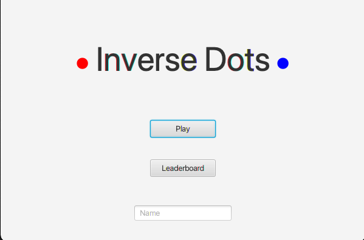
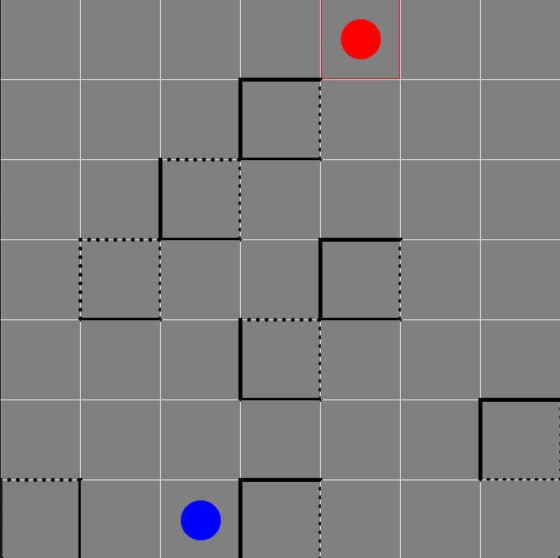

Inverse-Dots
=========================

Inverse-Dot game implementation based on homework-template-project and javafx-board-game-example3.

Goal of the game:
-----------------
Use the mouse to control the red dot on the board. The blue dot will replicate your movements but in the inverse direction. The goal is for the two dots to meet. Avoid walls on your way. You are able to cross dotted but not solid lines. The movement of the red dot is restricted based on the blue dot's position.

How to use:
-----------
Compile with JDK version 16 (or higher) use `mvn javafx:run` to start the game. Click on the red dot to see its available moving positions and move to the desired position.

Screenshot:
-----------
Starting screen:

Game:

